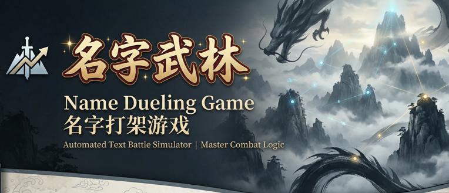

# Name Fight

Web 和 AstrBot 现已共用 `web_animation/battle/` 的动作和特效实现.
Web 可通过 `web/dev.bat` 启动, 动作预览在 `/motion-preview.html`.
同步架构、测试和 Linux Bot 更新步骤见 [两端兼容说明](SHARED_ANIMATION.md).

Name Fight 是一个基于姓名生成角色的 AstrBot 群聊武侠对战插件。

现在的玩法已经不只是创建角色后直接 PK, 而是完整的养成循环: 创建角色, 参与 1v1 或 3v3 正常挑战赚积分, 在商店兑换道具, 把低星角色培养到 5.0 星, 再突破到 6.0 星, 或通过洗武学继续优化流派。

如果你是第一次接触这个插件, 先记住这条主线就够了:

`创建角色 -> 正常对战赚积分 -> 商店买道具 -> 喂经验补到 5 星 -> 突破 6 星 -> 洗武学优化`

## 一分钟上手

1. 创建角色: `/create 角色名`
2. 查看角色栏并切换出战: `/roster`, `/use 角色名`
3. 发起正常对战赚积分:
   - 1v1: `/c 目标角色名`
   - 3v3: `/t3 @目标玩家`
4. 每日签到: `/signin`
5. 查看积分与商店: `/wallet`, `/shop`
6. 购买道具并查看背包: `/buy 道具名 数量`, `/bag`
7. 喂经验培养角色: `/feed 角色名 道具名 [数量]`
8. 到 5.0 星后突破: `/break 角色名`
9. 想改流派时洗流派: `/reroll`, `/随机换武学`, `/换宗令`, `/天机残卷`, `/高级洗内功`, `/高级洗轻功`, `/pick`
10. 群管理或维护排行榜奖励时使用: `/weeksettle [1v1|3v3|all]`

## 新手上手流程

### 1. 创建角色与查看阵容

- `/create 角色名`
- `/roster`
- `/use 角色名`
- `/profile [角色名]`

每位玩家当前最多持有 3 个角色。如果已经满员, 再创建角色时会进入候选替换流程, 然后通过 `/choose 序号` 选择要顶替的旧角色栏位。

### 2. 通过正常挑战获取积分

正常挑战是主要资源来源。

- `1v1`: `/c 角色名`, 由对方 `/a` 接受或 `/r` 拒绝
- `3v3`: `/t3 @目标玩家`, 由对方 `/a3` 接受或 `/r3` 拒绝

只有正常接受后开始的对战会发放积分奖励。

强制战斗也保留, 但它们只用于娱乐或快速验证阵容, 不产出积分和道具:

- `/fc 角色名`
- `/fc3 @目标玩家`

### 3. 商店、积分与背包

- `/signin` 每日签到领取积分
- `/wallet` 查看当前积分
- `/shop` 查看当前商店商品
- `/buy 道具名 数量` 购买道具
- `/bag` 查看背包

当前道具大致分为三类:

- 星经验丹: 用来补星
- 突破丹: 用于 5.0 星后突破到 6.0 星
- 洗武学道具: 用来重抽或定向更换武学

常见道具与实际用法:

- `小星尘丹` / `中星尘丹`: 用 `/feed 角色名 道具名 [数量]` 增加星经验
- `破境丹`: 用 `/break 角色名`, 只能对 `5.0 星` 角色使用
- `洗髓符`: 用 `/随机换武学 角色名` 或 `/洗髓符 角色名`, 随机更换武学
- `换宗令`: 用 `/换宗令 内功|轻功|武功 角色名`, 也可直接用 `/换内功 角色名`、`/换轻功 角色名`、`/换武功 角色名`
- `天机残卷`: 用于高级自选洗练, 每次先生成 3 个候选, 再用 `/pick 1|2|3` 确认最终结果

`天机残卷` 现在支持三种高级自选:

- 高级洗武功: `/reroll3 角色名`、`/自选换武学 角色名` 或 `/天机残卷 角色名`
- 高级洗内功: `/高级洗内功 角色名`
- 高级洗轻功: `/高级洗轻功 角色名`
- 统一写法: `/天机残卷 武功|内功|轻功 角色名`

### 4. 把角色培养到 5.0 星

- `/feed 角色名 道具名 [数量]`

角色会在 `1.0` 到 `5.0` 星之间成长。补星使用的是星经验机制, 不是简单固定加成。也就是说, 低星角色后天补到 `5.0` 星后, 会与先天 `5.0` 星角色在资质档位上等价。

这意味着:

- 初始低星不是废角色, 只是培养成本更高
- 4.5 星升到 5.0 星会比低星前期更难
- 先天高星角色的优势主要体现在起跑更快, 更早进入后续突破阶段

### 5. 从 5.0 星突破到 6.0 星

- `/break 角色名`

当前版本封顶 `6.0` 星。只有先达到 `5.0` 星的角色才能突破。

你可以把它理解成两套成长阶段:

- `1.0 ~ 5.0 星`: 基础资质体系
- `6.0 星`: 满星后的突破体系

无论角色是天生高星还是后天补上来的, 只要到了 `5.0` 星, 就能站在同一条突破起跑线上。

### 6. 洗武学与流派优化

- `/reroll 角色名 初级|中级`
- `/随机换武学 角色名`
- `/换宗令 内功|轻功|武功 角色名`
- `/reroll3 角色名`
- `/高级洗内功 角色名`
- `/高级洗轻功 角色名`
- `/天机残卷 武功|内功|轻功 角色名`
- `/pick 1|2|3`

洗武学属于后期优化线, 更适合已经成型的主力角色。

当前规则:

- 初级洗练: 消耗 `洗髓符`, 在全武学池随机更换 1 个武学
- 中级洗练: 消耗 `换宗令`, 随机更换指定的 `内功`、`轻功` 或 `武功`
- 顶级洗练: 消耗 `天机残卷`, 为指定类型生成 3 个候选, 再由玩家自己选 1 个

洗练只改对应的武学 / 内功 / 轻功, 不会清掉你的补星、突破和培养进度。

如果你想直接照着命令用:

- 想随机换武学: `/随机换武学 角色名`
- 想随机换内功: `/换内功 角色名`
- 想随机换轻功: `/换轻功 角色名`
- 想随机换武功: `/换武功 角色名`
- 想从 3 个武功里自选: `/天机残卷 角色名` 后接 `/pick 1|2|3`
- 想从 3 个内功里自选: `/高级洗内功 角色名` 后接 `/pick 1|2|3`
- 想从 3 个轻功里自选: `/高级洗轻功 角色名` 后接 `/pick 1|2|3`

## 核心机制说明

### 星级与成长

- 角色初始星级在 `1.0` 到 `5.0` 星之间
- 星级越高, 初始资质越高
- 低星可通过星经验一路补到 `5.0` 星
- 补到 `5.0` 星后, 与先天 `5.0` 星等价
- 当前版本上限是 `6.0` 星

### 积分经济

积分主要来自以下渠道:

- 每日签到
- 正常接受后的 1v1 对战
- 正常接受后的 3v3 对战
- 周榜结算奖励

不产资源的内容:

- `/fc`
- `/fc3`

### 排行榜与周榜奖励

- `/rank` 查看 1v1 排行榜
- `/rank3` 查看 3v3 排行榜
- `/weeksettle [1v1|3v3|all]` 手动结算周榜奖励

当前周榜奖励规则:

- 第 1 名: `500` 积分 + 顶级洗练道具
- 第 2 至 3 名: `300` 积分 + 中级洗练道具
- 第 4 至 10 名: `150` 积分

同一群、同一周、同一榜单只能结算一次。

### 世界 BOSS

世界 BOSS 是群内共享进度玩法，适合已经凑齐 `3v3` 阵容的玩家一起推。

- 管理员开启活动: `/bossopen`
- 查看当前状态: `/boss`
- 挑战世界 BOSS: `/bossfight`
- 查看贡献榜: `/bossrank`
- 管理员关闭活动: `/bossclose`
- 管理员查看或触发结算: `/bosssettle`

当前规则:

- 每次挑战都会先打一阶段门槛
- 只有成功进入二阶段后的伤害，才会计入群共享血量和贡献榜
- 默认每人每天 `3` 次挑战次数
- 击杀后按贡献榜发放积分奖励
- 如果活动未击杀就关闭，则不会发放击杀奖励

### 1v1、3v3 与强制战斗的区别

- `1v1`: 适合单角色对决和日常积分获取
- `3v3`: 更看阵容深度和出战顺序
- `强制战斗`: 不需要对方确认, 但不产资源

### 推荐培养思路

- 前期先把一个主力角色养起来, 不要分散投资
- 低星角色先补星, 不要一开始就乱洗武学
- 先有稳定积分来源, 再考虑高价洗练道具
- 主力到 `5.0` 星后, 先考虑突破到 `6.0` 星
- 洗武学更适合在角色已经成型后使用

## 完整指令表

### 角色管理

- `/fhelp`
- `/guide`
- `/create 角色名`
- `/choose 序号`
- `/roster`
- `/use 角色名`
- `/profile [角色名]`

### 1v1 战斗

- `/c 角色名`
- `/a`
- `/r`
- `/fc 角色名`
- `/rank`

### 3v3 战斗

- `/t3 @目标`
- `/a3`
- `/r3`
- `/fc3 @目标`
- `/team3`
- `/teamorder 2 1 3`
- `/rank3`

### 积分与商店

- `/signin`
- `/wallet`
- `/shop`
- `/buy 道具名 数量`
- `/bag`

### 培养与突破

- `/feed 角色名 道具名 [数量]`
- `/break 角色名`
- `/reroll 角色名 初级|中级`
- `/随机换武学 角色名`
- `/洗髓符 角色名`
- `/换内功 角色名`
- `/换轻功 角色名`
- `/换武功 角色名`
- `/换宗令 内功|轻功|武功 角色名`
- `/reroll3 角色名`
- `/高级洗内功 角色名`
- `/高级洗轻功 角色名`
- `/自选换武学 角色名`
- `/天机残卷 角色名`
- `/天机残卷 武功|内功|轻功 角色名`
- `/pick 1|2|3`

### 排行与结算

- `/rank`
- `/rank3`
- `/weeksettle`
- `/weeksettle 1v1`
- `/weeksettle 3v3`
- `/weeksettle all`

## 版本说明

当前版本已经从单纯对战扩展为完整养成玩法, 主要包括:

- 积分系统
- 商店与背包
- 星经验补星
- 5.0 星突破到 6.0 星
- 武学洗练
- 周榜奖励结算

如果群友已经不知道现在该先做什么, 直接让他先看 `/guide` 即可。
